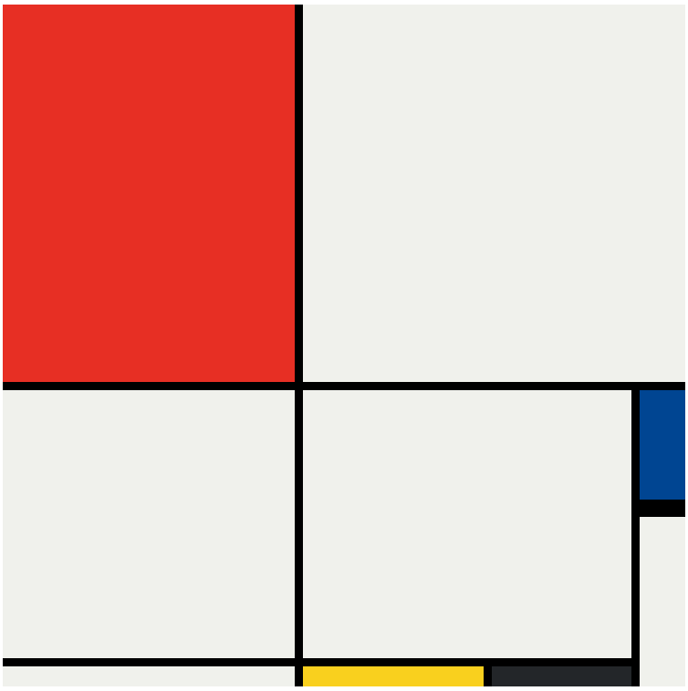

# Mondrian Project

This project is a recreation of a Mondrian-style grid layout using HTML and CSS. The design features a grid with colored blocks inspired by the works of Piet Mondrian.

## How to Run

1. Clone the repository:

   ```bash
   git clone https://github.com/your-username/mondrian-project.git
   ```

2. open `index.html` in your web browser.

## Demo



## License

This project is licensed under the MIT License.
